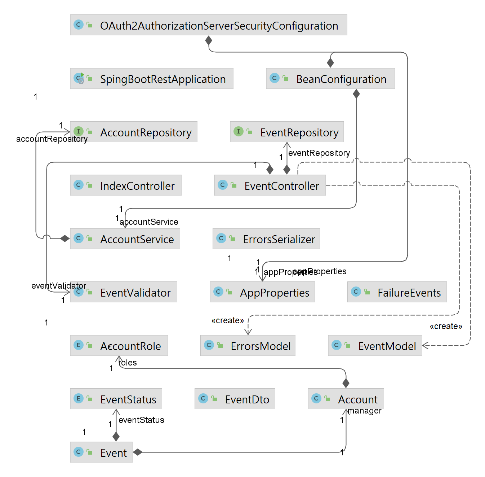

# Spring Boot REST Study

- REST APi 구성 요소에 대한 영상
    
    [https://www.youtube.com/watch?v=RP_f5dMoHFc](https://www.youtube.com/watch?v=RP_f5dMoHFc)
    

Self-Describtive Message와 HATEOAS(Hypermedia as the engine of application state)를 만족하는 REST API를 개발을 목적으로 한다.



## 구현 기술

Spring HATATOS [**Hypermedia As The Engine Of Application State**]

- 참고 사이트
    
    [Spring HATEOAS](https://spring.io/projects/spring-hateoas)
    

API 호출 시 아래 예제와 같이 현재 상태에 따라서 자신과 변경 가능한 상태를 링크로 나타낸다.

```json
{
    "_links": {
        "self": {
            "href": "http://localhost:8080/api/events/?page=0&size=20"
        },
        "profile": {
            "href": "/docs/index.html#resources-events-list"
        }
    },
    "page": {
        "size": 20,
        "totalElements": 0,
        "totalPages": 0,
        "number": 0
    }
}
```

같은 리스트 목록 요청 이지만 상태에 따라 자기 증명이 가능한 하이퍼 미디어 링크를 제공한다.

```json

{
                "id": 22,
                "name": "Spring",
                "description": "REST API Development with Spring",
                "beginEnrollmentDateTime": "2018-11-23T14:21:00",
                "closeEnrollmentDateTime": "2018-11-24T14:21:00",
                "beginEventDateTime": "2018-11-25T14:21:00",
                "endEventDateTime": "2018-11-26T14:21:00",
                "location": "강남역 D2 스타텁 팩토리",
                "basePrice": 100,
                "maxPrice": 200,
                "limitOfEnrollment": 100,
                "offline": true,
                "free": false,
                "eventStatus": "DRAFT",
                "manager": null,
                "_links": {
                    "self": {
                        "href": "http://localhost:8080/api/events/22"
                    }
                }
            }
        ]
    },
    "_links": {
        "first": {
            "href": "http://localhost:8080/api/events/?page=0&size=20"
        },
        "self": {
            "href": "http://localhost:8080/api/events/?page=0&size=20"
        },
        "next": {
            "href": "http://localhost:8080/api/events/?page=1&size=20"
        },
        "last": {
            "href": "http://localhost:8080/api/events/?page=2&size=20"
        },
        "profile": {
            "href": "/docs/index.html#resources-events-list"
        }
    },
    "page": {
        "size": 20,
        "totalElements": 45,
        "totalPages": 3,
        "number": 0
    }
}
```

Spring Rest Docs

- 참고 사이트
    
    [Spring REST Docs](https://spring.io/projects/spring-restdocs)
    

 API 자신을 설명 할 수 있는 방법을 제공을 목적으로 한다. 해당 정보는 profile 링크로 HTML 문서로 제공하는 방식을 사용하였다.

- API 설명의 예시
    
    ### [이벤트 생성]
    
    `POST` 요청을 사용해서 새 이벤트를 만들 수 있다.
    
    ### [Request fields]
    
| name | Type | Description |
| --- | --- | --- |
| description | String | description of new event |
| beginEnrollmentDateTime | String | date time of beginEnrollmentDateTime |
| closeEnrollmentDateTime | String | date time of closeEnrollmentDateTime |
| beginEventDateTime | String | date time of beginEventDateTime |
| endEventDateTime | String | date time of endEventDateTime |
| location | String | location of new event |
| basePrice | Number | basePrice of new event |
| maxPrice | Number | maxPrice of new event |
| limitOfEnrollment | Number | limitOfEnrollment of new event |
    
    ### [Example request]
```bash
$ curl 'http://localhost:8080/api/events/' -i -X POST \
    -H 'Content-Type: application/hal+json' \
    -H 'Accept: application/hal+json' \
    -d '{
  "name" : "Spring",
  "description" : "REST API Development with Spring",
  "beginEnrollmentDateTime" : "2018-11-23T14:21:00",
  "closeEnrollmentDateTime" : "2018-11-24T14:21:00",
  "beginEventDateTime" : "2018-11-25T14:21:00",
  "endEventDateTime" : "2018-11-26T14:21:00",
  "location" : "강남역 D2 스타텁 팩토리",
  "basePrice" : 100,
  "maxPrice" : 200,
  "limitOfEnrollment" : 100
}'
```
